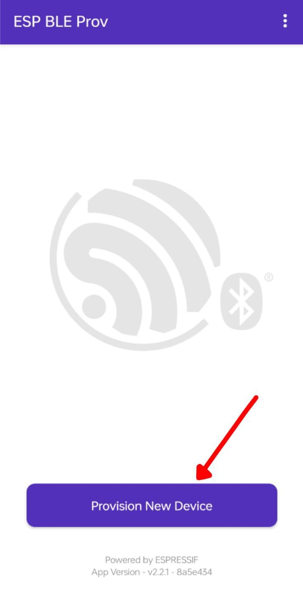

# ESP32 BLE Wi-Fi Provisioning

## Overview

This project demonstrates **Wi-Fi BLE provisioning** for ESP32 using **ESP-IDF**. It allows users to configure Wi-Fi credentials via a mobile app using **Bluetooth Low Energy (BLE)**.

---

## Prerequisites

### **1. Install ESP-IDF**

Follow the official [ESP-IDF setup guide](https://docs.espressif.com/projects/esp-idf/en/latest/esp32/get-started/index.html) to install ESP-IDF.

### **2. Required Hardware**

- ESP32 development board
- USB cable

---

## Setup & Build Instructions

### **1. Clone the Repository**

```sh
cd F:/intern-project/
git clone https://github.com/example/esp32-ble-provisioning.git ble_provisioning
cd ble_provisioning
```

### **2. Set ESP-IDF Path** (Windows Users)

```sh
idf.py --version  # Verify ESP-IDF is set up
```

### **3. Configure the Project**

```sh
idf.py menuconfig
```

- Navigate to **Example Configuration**
- Select **Provisioning Transport** → **BLE**
- Save and exit

### **4. Build & Flash**

```sh
idf.py build flash
```

### **5. Start Serial Monitor**

```sh
idf.py monitor
```

---

## Mobile App Setup

### **1. Install ESP BLE Provisioning App**

- Download from **Google Play Store** / **Apple App Store**
- Open the app and scan for the ESP32 device

### **2. Connect & Provision**

- Select the ESP32 device
- Enter Wi-Fi SSID & Password
- Click **Provision**
- ESP32 connects to Wi-Fi and stores credentials

---

## Expected Output

```
I (5000) app: Starting BLE provisioning...
I (5005) wifi_prov_mgr: Provisioning started with BLE scheme
I (10000) app: Wi-Fi connected successfully!
```

### **📸 Screenshot 1: ESP32 Advertising BLE**
<p align="center">
  
</p>


### **📸 Screenshot 2: Mobile App Entering Wi-Fi Credentials**


### **📸 Screenshot 3: Successful Wi-Fi Connection**


### **📸 Screenshot 3: Successful Wi-Fi Connection**


---

## Troubleshooting

### **1. ESP32 Not Appearing in BLE Scan?**

- Ensure BLE is enabled in **menuconfig**.
- Restart the ESP32 and try again.

### **2. Wi-Fi Not Connecting?**

- Double-check SSID & password.
- Move ESP32 closer to the router.

### **3. Monitor Not Showing Logs?**

- Run `idf.py monitor` to debug real-time logs.

---

## Conclusion

ESP32 BLE Wi-Fi provisioning **eliminates hardcoded Wi-Fi credentials** and makes user setup simple. 🚀

