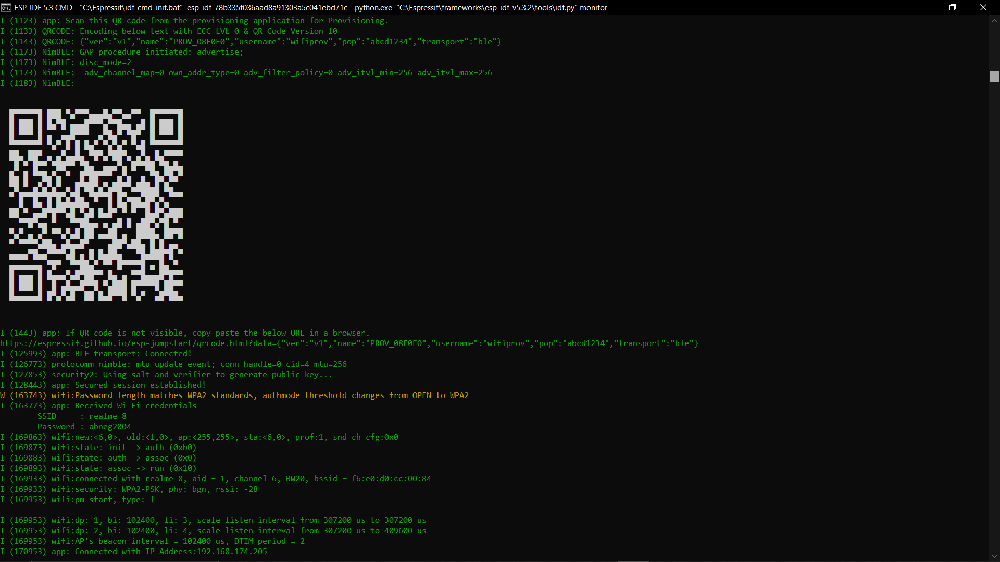
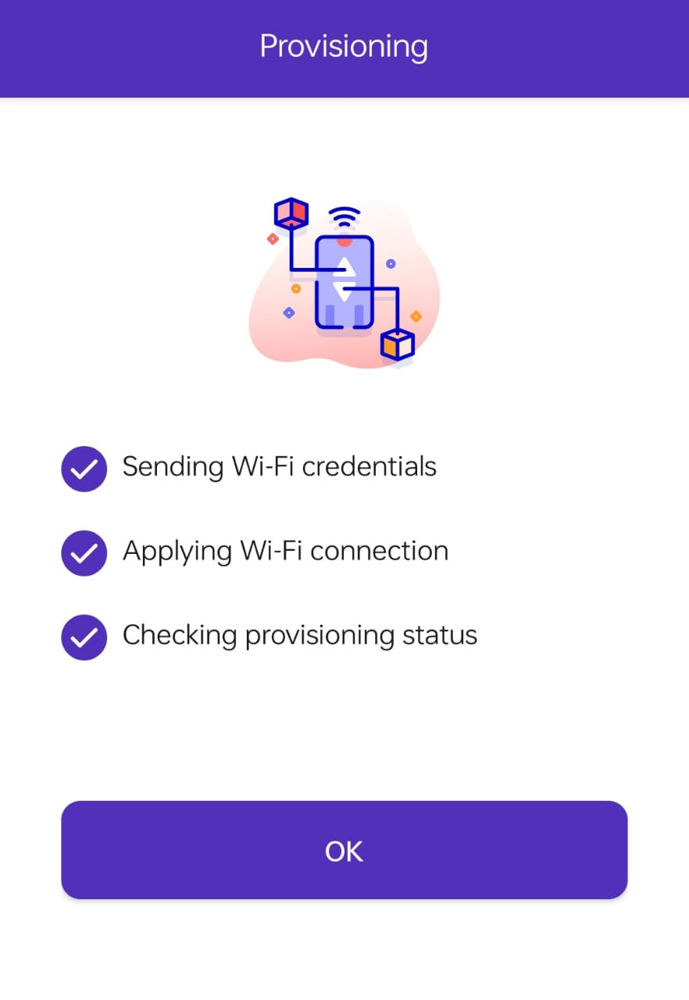
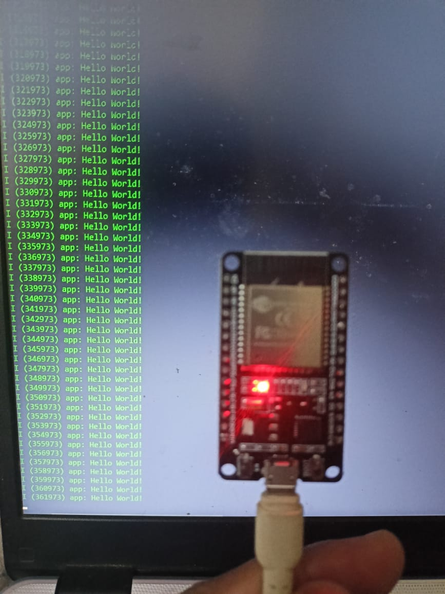

# ESP32 BLE Wi-Fi Provisioning using ESP IDF

## Overview

This project demonstrates **Wi-Fi BLE provisioning** for ESP32 using **ESP-IDF**. It allows users to configure Wi-Fi credentials via a mobile app using **Bluetooth Low Energy (BLE)**. I have used the same code that is there in - https://github.com/espressif/esp-idf/tree/master/examples/provisioning/wifi_prov_mgr , but I made few changes as I was using ESP IDF 5.3 CMD, and some fields of that code do not exist in ESP-IDF v5+.

---

## Prerequisites

### **1. Install ESP-IDF**

Follow the official [ESP-IDF setup guide](https://docs.espressif.com/projects/esp-idf/en/latest/esp32/get-started/index.html) to install ESP-IDF.

### **2. Required Hardware**

- ESP32 development board
- USB cable

---

## Setup & Build Instructions

### **1. Clone the Repository**

```sh
cd F:/intern-project/
git clone https://github.com/abnegative2904/ESP32_WIFI_BLE_PROVISIONING.git ble_provisioning
cd ble_provisioning
```

### **2. Set ESP-IDF Path** (Windows Users)

```sh
idf.py --version  # Verify ESP-IDF is set up
```

### **3. Configure the Project**

```sh
idf.py menuconfig
```

- I didnt made any changes in this.

### **4. Build & Flash**

```sh
idf.py build flash
```

### **5. Start Serial Monitor**

```sh
idf.py monitor
```

---

## Mobile App Setup

### **1. Install ESP BLE Provisioning App**

- Download from **Google Play Store** / **Apple App Store**
- Open the app and scan for the ESP32 device

### **2. Connect & Provision**

- Select the ESP32 device
- Enter Wi-Fi SSID & Password
- Click **Provision**
- ESP32 connects to Wi-Fi and stores credentials

---

## Expected Output

```
I (5000) app: Starting BLE provisioning...
I (5005) wifi_prov_mgr: Provisioning started with BLE scheme
I (10000) app: Wi-Fi connected successfully!
```

### **📸 Screenshot 1: Mobile App**
<p align="center">
  
</p>


### **📸 Screenshot 2: QR Generation after idf.py monitor**
<p align="center">

</p>

### **📸 Screenshot 3: Succesful Wifi shared via Bluetooth**
<p align="center">

</p>

### **📸 Screenshot 3: Output Log**
<p align="center">

</p>

### **Demo Video**
https://github.com/user-attachments/assets/764823e2-1029-4787-ade7-38fb97db0efa

---


## Conclusion

ESP32 BLE Wi-Fi provisioning **eliminates hardcoded Wi-Fi credentials** and makes user setup simple. 

